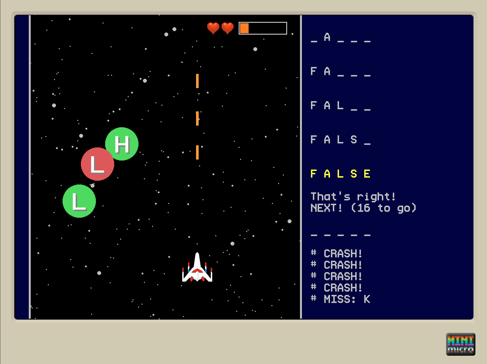

# Letter Shooter

How well do you know miniscript? Prove it by "shooting" all its keywords ... one letter at a time.

Fusion between the genres "asteroid shooter" and "guess-the-word" (hangman)

Submission for the [Mini Micro New Year 2022 Game-Jam](https://itch.io/jam/mini-micro-new-year-2022) where the theme was "fusion" (of genres).

Made on the [Mini Micro](https://miniscript.org/MiniMicro/), written in [miniscript](https://miniscript.org/).

## Instructions

Move with the arrow keys. Shoot with the space.

You have limited lives. These are shown by the "hearts".

You have an energy bar. When the energy is drained, you lose one life. When you lose all lives, it's "Game Over".

Shooting the right letters will help you in "guessing" it. Shooting at the wrong letters will drain energy. Crashing on letters will also drain energy.

Have fun!
